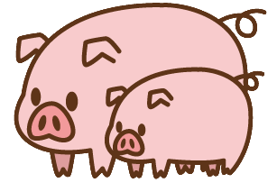
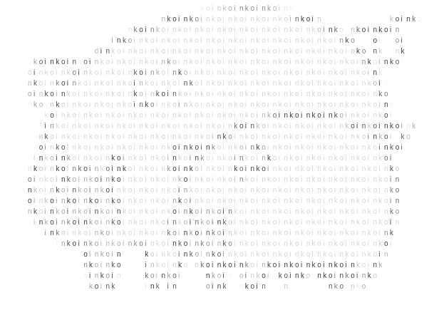
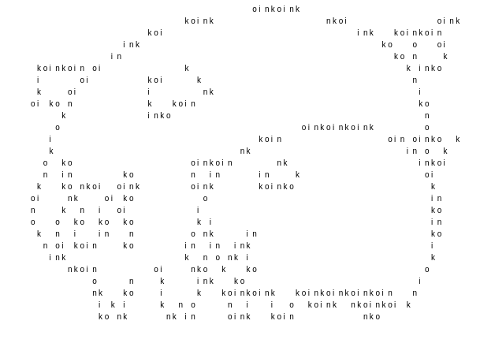

>*Textifier is a dart library that lets you convert images to any text of your choosing, in your browser*

| Original | Colored | Grayscale | Monochrome | Console |
| --- | --- | --- | --- | --- |
|  |  |  |  |  |

Textifier can print as HTML an image or it can even print it in you browser's console.

## Instalation

  ```bash
  $ pub get textifier
  ```

## Usage

  Here is the mandatory one-liner to show how simple it can be.
  ```dart
  new Textifier().draw('images/piggies.png', target);
  ```

  Of course you are probably going to want use some options. Textifier takes a few optional named arguments.

### :warning: NOTES :warning:

  Textifier needs CORS access to the source images.

### optional arguments

Every other option will be in the option object.

  | Names | Defaults | Types | Info
  | --- | --- | --- | ---
  | maxWidth | `Infinity` | `String\|num`  | maxWidth should be a positive number. This sets maximum width of the rendered image. If it is not set or set with an invalid value, it will take as much space as it can.<br>Valid values are either a number or a valid CSS size value (e.g `200px`).<br>Unless specified units will be measured in characters.
  | maxHeight | `"Infinity"` | `String\|num`  | Same as maxWidth except that if it is not set the maximum height will be the the same as the height of the original image but in characters instead of pixels.
  | characters | `"01"` | `String`  | The character list to write the image with.
  | background | `"#00000000"` | `String`   | Color of the background. This color will also be rendered in text.
  | ordered | `false` | `bool`  | If true the characters will show up in order of the `characters` string
  | color | `0` | `int` | If the image should be colored, in grayscale or monochrome<br>`0 = colored`<br>`1 = grayscale`<br>`2 = monochrome`<br>Textifier comes with some [constants](#constants) so you don't have to memorize this

## Functions
  There are 3 main functions in Textifier, write, draw and log. There a few other mainly used internally but available anyways since they might come in handy.
### write, draw
  `arguments: (String url, Element element, bool append)`

  The `write` and `draw` functions work exactly the same way. The only difference is that `write` will print html in a \<pre> tag and the `draw` will print an actual image on a canvas.
#### url
  `type: String`

  The url of the image to be used.
#### element
  `type: Element`

  The element in which the rendered image will be added to.
#### append
  `type: bool`

  If the rendered image should be appended or replace the contents of the target `element`.

##### **Example**

  ```dart
  new Textifier(maxWidth: 100, characters: 'oink', ordered: true).draw('images/piggies.png', target);
  ```
##### Output
  


### log
  `arguments: (String url)`

  The `log` function will print the image in the dev console of your browser.
#### url
  `type: String`

  The url of the image to be used.

##### **Example**

  ```dart
  new Textifier(maxWidth: 100, characters: 'oink', ordered: true).log('images/piggies.png');
  ```
##### Output
  

## Constants
  Textifier comes with some "constants" so you don't have to remember arguments that are numbers and to make your code more readable.

  ```dart
  Textifier.COLORED = 0;
  Textifier.GRAYSCALE = 1;
  Textifier.MONOCHROME = 2;

  Textifier.HTML = 0;
  Textifier.CANVAS = 1;
  Textifier.CONSOLE = 2;
  ```

## License
   [MIT License](LICENSE.md)
